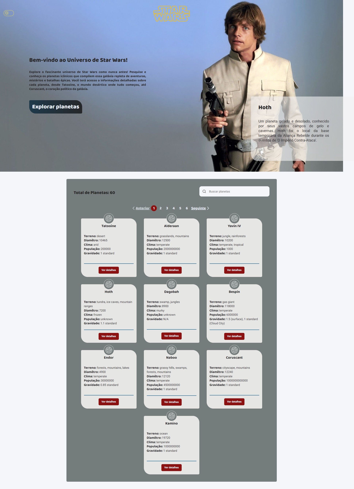
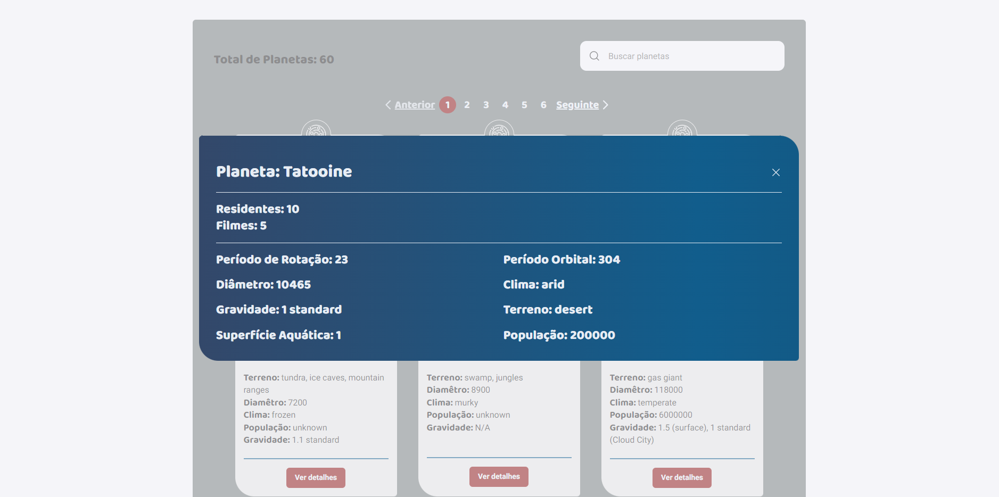
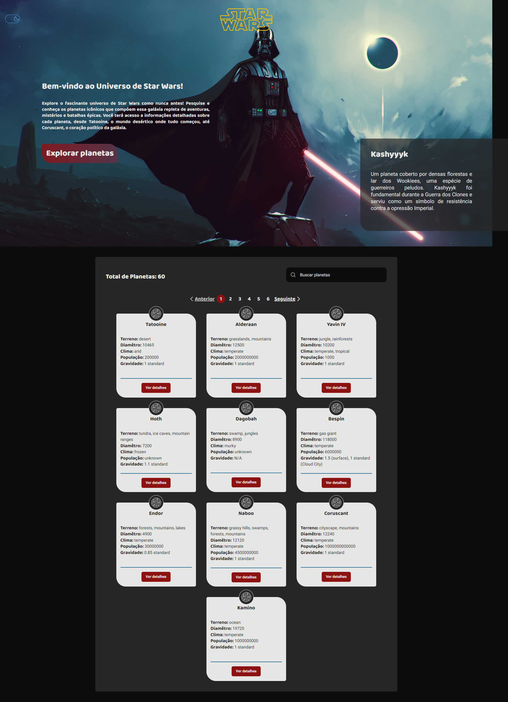
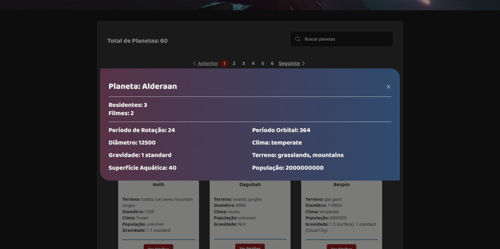
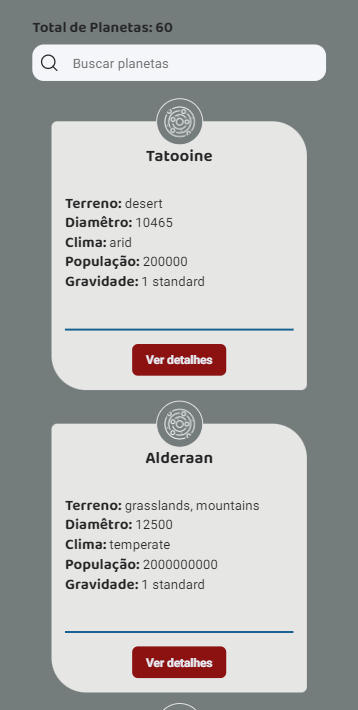
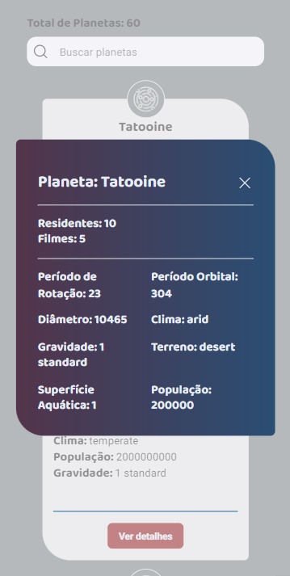
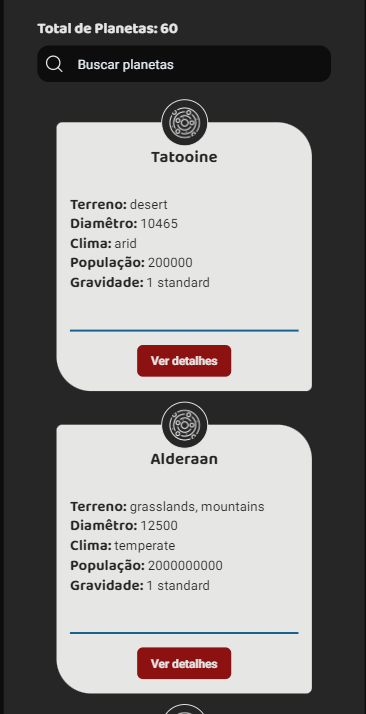
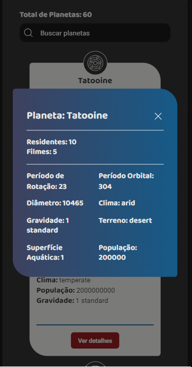
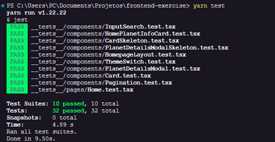
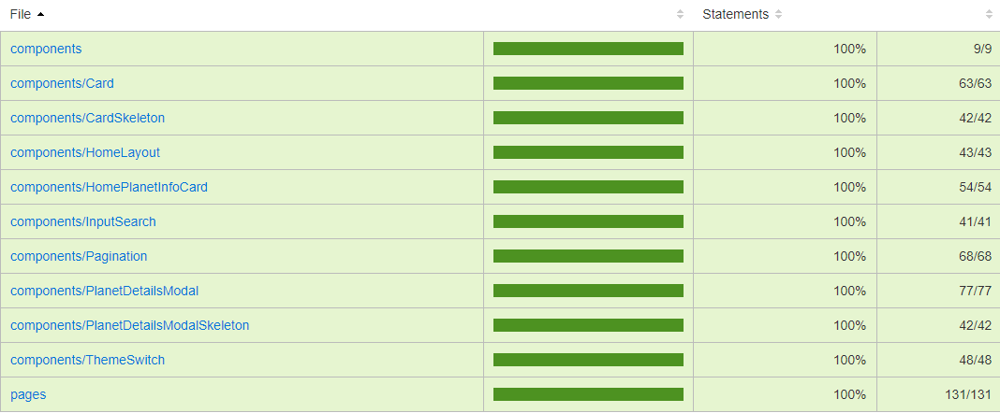

# Frontend Exercise - Star Wars Planets with SWAPI

A frontend application to list and search for Star Wars planets using the [SWAPI](https://swapi.dev/documentation#intro) API.

## [LIVE DEMO](https://frontend-exercise-ten.vercel.app)

## Technologies Used

- React JS 
- CSS Modules
- SWR 
- Unit tests with Jest

## Features

- List planets
- Search planets
- Theme Switch (Light and Dark mode)
- Responsive design

## Screenshots

### Desktop

<table style="width:100%;">
	<tr>
		<th style="text-align:center;">
			<h4>Light Theme</h4>
		</th>
	</tr>
	<tr>
		<td>
			
			
		</td>
	</tr>
	<tr>
		<th style="text-align:center;">
			<h4>Dark Theme</h4>
		</th>
	</tr>
	<tr>
		<td>
			
			
		</td>
	</tr>
</table>

### Mobile

<table style="width:100%;">
	<tr>
		<th style="text-align:center;">
			<h4>Light Theme</h4>
		</th>
	</tr>
	<tr>
		<td style="display:flex; justify-content:space-around;">
			
			
			
		</td>
	</tr>
	<tr>
		<th style="text-align:center;">
			<h4>Dark Theme</h4>
		</th>
	</tr>
	<tr>
		<td style="display:flex; justify-content:space-around;">
			
			
			
		</td>
	</tr>
</table>

### Tests using Jest

<table style="width:100%;">
	<tr>
		<th style="text-align:center;">
			<h4>Unit test</h4>
		</th>
	</tr>
	<tr>
		<td>
			
		</td>
	</tr>
	<tr>
		<th style="text-align:center;">
			<h4>Coverage</h4>
		</th>
	</tr>
	<tr>
		<td>
			
		</td>
	</tr>
</table>

## How to Use


```bash
# Clone the repository to your local machine using:
git clone https://github.com/PauloHenriqueSousa2020/frontend-exercise

# Navigate to the project folder:
cd frontend-exercise

# Install the project dependencies:
yarn install or npm install

# To run the project:
yarn dev or npm run dev

# To run the unit tests after installing the project dependencies:
yarn test or yarn test:coverage
